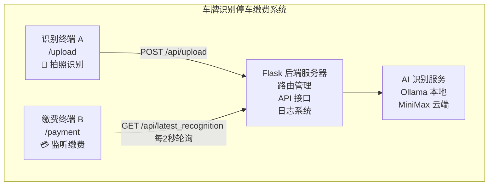
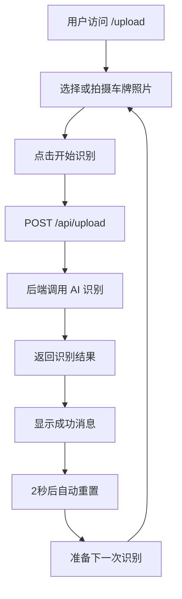
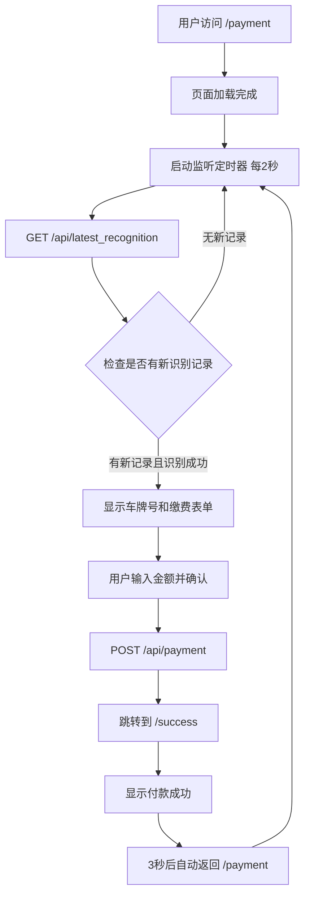
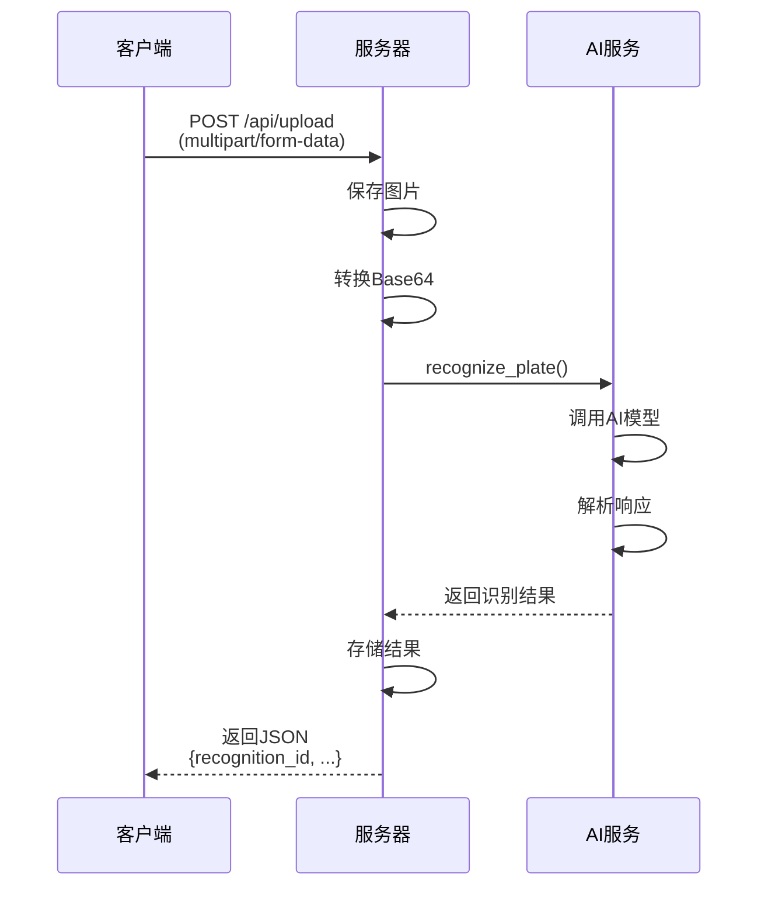
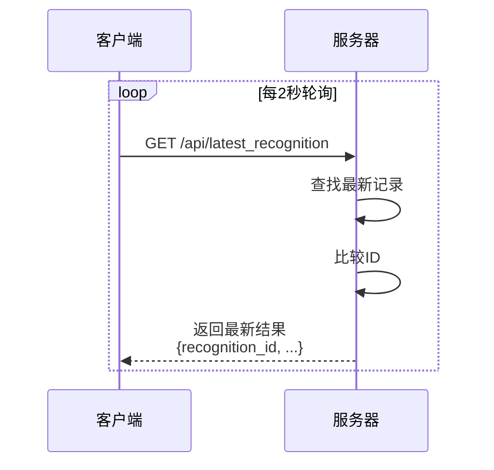
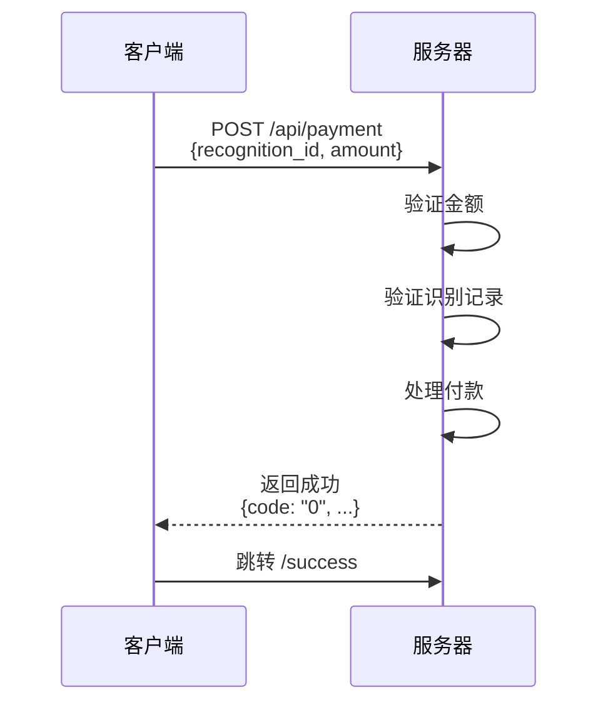

# 系统架构说明

## 整体架构



## 页面流程

### 识别页面流程



### 缴费页面流程



## 数据流

### 1. 图片上传识别



### 2. 监听最新识别



### 3. 处理付款



## 核心组件

### 前端组件

#### 1. upload.js
- 文件选择处理
- 图片预览
- 上传请求
- 状态显示
- 自动重置

#### 2. payment.js
- 监听定时器
- 轮询最新识别
- 显示缴费表单
- 付款请求
- 页面跳转

#### 3. style.css
- 响应式布局
- 动画效果
- 状态样式
- 移动端适配

### 后端组件

#### 1. app.py
- Flask 应用初始化
- 路由定义
- API 接口
- 日志中间件
- 请求处理

#### 2. ai_service.py
- AI 服务封装
- Ollama 集成
- MiniMax 集成
- 响应解析
- 错误处理

## 数据存储

### 内存存储（当前实现）
```python
recognition_results = {
    "0": {
        "code": "0",
        "plate_number": "粤A5A66A",
        "message": "解析完成"
    },
    "1": {
        "code": "0",
        "plate_number": "京B12345",
        "message": "解析完成"
    }
}
```

### 数据库存储（生产环境建议）
```sql
CREATE TABLE recognitions (
    id INTEGER PRIMARY KEY AUTOINCREMENT,
    plate_number VARCHAR(20),
    image_path VARCHAR(255),
    status VARCHAR(20),
    created_at TIMESTAMP,
    paid BOOLEAN DEFAULT FALSE
);

CREATE TABLE payments (
    id INTEGER PRIMARY KEY AUTOINCREMENT,
    recognition_id INTEGER,
    amount DECIMAL(10,2),
    paid_at TIMESTAMP,
    FOREIGN KEY (recognition_id) REFERENCES recognitions(id)
);
```

## API 接口规范

### 1. POST /api/upload
**请求：**
- Content-Type: multipart/form-data
- Body: image (file)

**响应：**
```json
{
  "recognition_id": "0",
  "code": "0",
  "plate_number": "粤A5A66A",
  "message": "解析完成"
}
```

### 2. GET /api/latest_recognition
**响应：**
```json
{
  "recognition_id": "0",
  "code": "0",
  "plate_number": "粤A5A66A",
  "message": "解析完成"
}
```

### 3. POST /api/payment
**请求：**
```json
{
  "recognition_id": "0",
  "amount": "10"
}
```

**响应：**
```json
{
  "code": "0",
  "message": "付款成功",
  "plate_number": "粤A5A66A"
}
```

## 错误处理

### 错误码定义
- `0`: 成功
- `1`: 未找到图片文件
- `2`: 未选择文件
- `3`: 未找到识别记录
- `4`: 缺少必要参数
- `5`: 付款金额不正确
- `6`: 金额格式错误
- `7`: 识别记录不存在
- `8`: 车牌识别未成功
- `10`: 不支持的AI提供商
- `11-14`: AI服务相关错误
- `99`: 服务器错误

## 性能优化

### 前端优化
1. 图片压缩后上传
2. 防抖处理避免重复请求
3. 轮询间隔可配置
4. 使用 CSS 动画而非 JS

### 后端优化
1. 异步处理 AI 识别
2. 结果缓存
3. 图片存储优化
4. 数据库索引

### 扩展性
1. 支持多个识别终端
2. 支持多个缴费终端
3. 负载均衡
4. 分布式存储

## 安全考虑

1. **文件上传安全**
   - 文件类型验证
   - 文件大小限制（16MB）
   - 文件名安全处理

2. **API 安全**
   - CORS 配置
   - 请求频率限制
   - 参数验证

3. **数据安全**
   - 敏感信息加密
   - API Key 环境变量存储
   - 日志脱敏

## 部署建议

### 开发环境
```bash
python app.py
```

### 生产环境
```bash
gunicorn -w 4 -b 0.0.0.0:5001 app:app
```

### Docker 部署
```dockerfile
FROM python:3.13
WORKDIR /app
COPY requirements.txt .
RUN pip install -r requirements.txt
COPY . .
CMD ["gunicorn", "-w", "4", "-b", "0.0.0.0:5001", "app:app"]
```

## 监控和日志

### 日志级别
- INFO: 正常操作
- WARNING: 警告信息
- ERROR: 错误信息

### 监控指标
- 请求数量
- 响应时间
- 识别成功率
- 付款成功率
- 错误率

## 未来扩展

1. **功能扩展**
   - 支持更多支付方式
   - 车辆进出记录
   - 停车时长计算
   - 优惠券系统

2. **技术扩展**
   - WebSocket 实时通信
   - Redis 缓存
   - 消息队列
   - 微服务架构

3. **AI 扩展**
   - 支持更多 AI 模型
   - 车型识别
   - 车辆颜色识别
   - 车辆损伤检测
